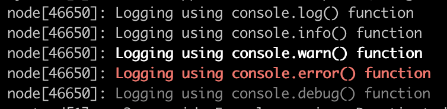

# Console Syslog Priority



A very simple node.js package to prepend [syslog priority levels](https://en.wikipedia.org/wiki/Syslog#Severity_level)
to all console logging calls.

This does not send console logs to syslog or anything like that, it just prepends the stdout with the priority level.

This is intended for node.js apps that are managed by systemd, so that their logs are stored in the journal
automatically, lacking a way to distinguish between errors and information when querying with journalctl.

## Usage

```
require("console-syslog-priority").enable()
```

To add an error domain, which will highlight any uncaught error printed before node exits with error priority, you can additionally use `enableDomain`.

```
const syslogPriority = require("console-syslog-priority")
syslogPriority.enable();
syslogPriority.enableDomain();
```

Note that the use of domains is deprecated in node.js, so this is not recommended.


